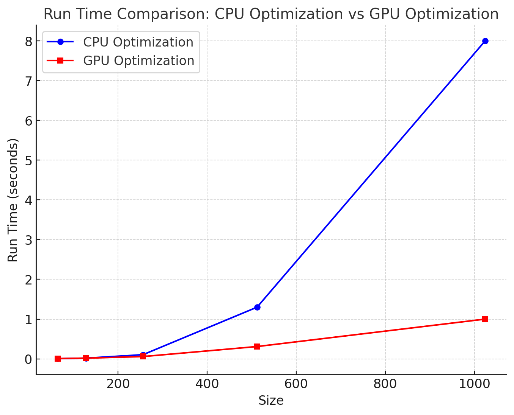

# MiniTorch Module 3

## Task 3.1

Output of `python project/parallel_check.py`

```
================================================================================
 Parallel Accelerator Optimizing:  Function tensor_map.<locals>._map,
/Users/adityaballaki/cornell/MLE/mod3-adi-bal/minitorch/fast_ops.py (180)
================================================================================


Parallel loop listing for  Function tensor_map.<locals>._map, /Users/adityaballaki/cornell/MLE/mod3-adi-bal/minitorch/fast_ops.py (180)
--------------------------------------------------------------------------|loop #ID
    def _map(                                                             |
        out: Storage,                                                     |
        out_shape: Shape,                                                 |
        out_strides: Strides,                                             |
        in_storage: Storage,                                              |
        in_shape: Shape,                                                  |
        in_strides: Strides,                                              |
    ) -> None:                                                            |
        if np.array_equal(out_strides, in_strides) and np.array_equal(    |
            out_shape, in_shape                                           |
        ):                                                                |
            for out_index in prange(len(out)):----------------------------| #2
                out[out_index] = fn(in_storage[out_index])                |
        else:                                                             |
            for out_index in prange(len(out)):----------------------------| #3
                out_idx: Index = np.zeros(MAX_DIMS, dtype=np.int32)-------| #0
                to_index(out_index, out_shape, out_idx)                   |
                                                                          |
                in_idx: Index = np.zeros(MAX_DIMS, dtype=np.int32)--------| #1
                broadcast_index(out_idx, out_shape, in_shape, in_idx)     |
                                                                          |
                out_value = index_to_position(out_idx, out_strides)       |
                in_pos = index_to_position(in_idx, in_strides)            |
                                                                          |
                out[out_value] = fn(in_storage[in_pos])                   |
--------------------------------- Fusing loops ---------------------------------
Attempting fusion of parallel loops (combines loops with similar properties)...
Following the attempted fusion of parallel for-loops there are 3 parallel for-
loop(s) (originating from loops labelled: #2, #3, #0).
--------------------------------------------------------------------------------
---------------------------- Optimising loop nests -----------------------------
Attempting loop nest rewrites (optimising for the largest parallel loops)...

+--3 is a parallel loop
   +--0 --> rewritten as a serial loop
   +--1 --> rewritten as a serial loop
--------------------------------------------------------------------------------
----------------------------- Before Optimisation ------------------------------
Parallel region 0:
+--3 (parallel)
   +--0 (parallel)
   +--1 (parallel)


--------------------------------------------------------------------------------
------------------------------ After Optimisation ------------------------------
Parallel region 0:
+--3 (parallel)
   +--0 (serial)
   +--1 (serial)


Parallel region 0 (loop #3) had 0 loop(s) fused and 2 loop(s) serialized as part
 of the larger parallel loop (#3).
--------------------------------------------------------------------------------
--------------------------------------------------------------------------------

---------------------------Loop invariant code motion---------------------------
Allocation hoisting:
The memory allocation derived from the instruction at
/Users/adityaballaki/cornell/MLE/mod3-adi-bal/minitorch/fast_ops.py (195) is
hoisted out of the parallel loop labelled #3 (it will be performed before the
loop is executed and reused inside the loop):
   Allocation:: out_idx: Index = np.zeros(MAX_DIMS, dtype=np.int32)
    - numpy.empty() is used for the allocation.
The memory allocation derived from the instruction at
/Users/adityaballaki/cornell/MLE/mod3-adi-bal/minitorch/fast_ops.py (198) is
hoisted out of the parallel loop labelled #3 (it will be performed before the
loop is executed and reused inside the loop):
   Allocation:: in_idx: Index = np.zeros(MAX_DIMS, dtype=np.int32)
    - numpy.empty() is used for the allocation.
None
ZIP

================================================================================
 Parallel Accelerator Optimizing:  Function tensor_zip.<locals>._zip,
/Users/adityaballaki/cornell/MLE/mod3-adi-bal/minitorch/fast_ops.py (232)
================================================================================


Parallel loop listing for  Function tensor_zip.<locals>._zip, /Users/adityaballaki/cornell/MLE/mod3-adi-bal/minitorch/fast_ops.py (232)
-----------------------------------------------------------------------------------------|loop #ID
    def _zip(                                                                            |
        out: Storage,                                                                    |
        out_shape: Shape,                                                                |
        out_strides: Strides,                                                            |
        a_storage: Storage,                                                              |
        a_shape: Shape,                                                                  |
        a_strides: Strides,                                                              |
        b_storage: Storage,                                                              |
        b_shape: Shape,                                                                  |
        b_strides: Strides,                                                              |
    ) -> None:                                                                           |
        if (                                                                             |
            np.array_equal(out_strides, a_strides)                                       |
            and np.array_equal(out_shape, b_shape)                                       |
            and np.array_equal(out_shape, a_shape)                                       |
            and np.array_equal(out_strides, b_strides)                                   |
        ):                                                                               |
            for idx in prange(len(out)):-------------------------------------------------| #7
                out[idx] = fn(a_storage[idx], b_storage[idx])                            |
        else:                                                                            |
            for out_idx in prange(len(out)):---------------------------------------------| #8
                current_out_idx: Index = np.zeros(MAX_DIMS, dtype=np.int32)--------------| #4
                to_index(out_idx, out_shape, current_out_idx)                            |
                                                                                         |
                a_broadcast_idx: Index = np.zeros(MAX_DIMS, dtype=np.int32)--------------| #5
                broadcast_index(current_out_idx, out_shape, a_shape, a_broadcast_idx)    |
                                                                                         |
                b_broadcast_idx: Index = np.zeros(MAX_DIMS, dtype=np.int32)--------------| #6
                broadcast_index(current_out_idx, out_shape, b_shape, b_broadcast_idx)    |
                                                                                         |
                out_position = index_to_position(current_out_idx, out_strides)           |
                a_storage_position = index_to_position(a_broadcast_idx, a_strides)       |
                b_storage_position = index_to_position(b_broadcast_idx, b_strides)       |
                                                                                         |
                out[out_position] = fn(                                                  |
                    a_storage[a_storage_position], b_storage[b_storage_position]         |
                )                                                                        |
--------------------------------- Fusing loops ---------------------------------
Attempting fusion of parallel loops (combines loops with similar properties)...
Following the attempted fusion of parallel for-loops there are 3 parallel for-
loop(s) (originating from loops labelled: #7, #8, #4).
--------------------------------------------------------------------------------
---------------------------- Optimising loop nests -----------------------------
Attempting loop nest rewrites (optimising for the largest parallel loops)...

+--8 is a parallel loop
   +--4 --> rewritten as a serial loop
   +--5 --> rewritten as a serial loop
   +--6 --> rewritten as a serial loop
--------------------------------------------------------------------------------
----------------------------- Before Optimisation ------------------------------
Parallel region 0:
+--8 (parallel)
   +--4 (parallel)
   +--5 (parallel)
   +--6 (parallel)


--------------------------------------------------------------------------------
------------------------------ After Optimisation ------------------------------
Parallel region 0:
+--8 (parallel)
   +--4 (serial)
   +--5 (serial)
   +--6 (serial)


Parallel region 0 (loop #8) had 0 loop(s) fused and 3 loop(s) serialized as part
 of the larger parallel loop (#8).
--------------------------------------------------------------------------------
--------------------------------------------------------------------------------

---------------------------Loop invariant code motion---------------------------
Allocation hoisting:
The memory allocation derived from the instruction at
/Users/adityaballaki/cornell/MLE/mod3-adi-bal/minitorch/fast_ops.py (256) is
hoisted out of the parallel loop labelled #8 (it will be performed before the
loop is executed and reused inside the loop):
   Allocation:: a_broadcast_idx: Index = np.zeros(MAX_DIMS, dtype=np.int32)
    - numpy.empty() is used for the allocation.
The memory allocation derived from the instruction at
/Users/adityaballaki/cornell/MLE/mod3-adi-bal/minitorch/fast_ops.py (253) is
hoisted out of the parallel loop labelled #8 (it will be performed before the
loop is executed and reused inside the loop):
   Allocation:: current_out_idx: Index = np.zeros(MAX_DIMS, dtype=np.int32)
    - numpy.empty() is used for the allocation.
The memory allocation derived from the instruction at
/Users/adityaballaki/cornell/MLE/mod3-adi-bal/minitorch/fast_ops.py (259) is
hoisted out of the parallel loop labelled #8 (it will be performed before the
loop is executed and reused inside the loop):
   Allocation:: b_broadcast_idx: Index = np.zeros(MAX_DIMS, dtype=np.int32)
    - numpy.empty() is used for the allocation.
None
REDUCE

================================================================================
 Parallel Accelerator Optimizing:  Function tensor_reduce.<locals>._reduce,
/Users/adityaballaki/cornell/MLE/mod3-adi-bal/minitorch/fast_ops.py (294)
================================================================================


Parallel loop listing for  Function tensor_reduce.<locals>._reduce, /Users/adityaballaki/cornell/MLE/mod3-adi-bal/minitorch/fast_ops.py (294)
------------------------------------------------------------------------------------------|loop #ID
    def _reduce(                                                                          |
        out: Storage,                                                                     |
        out_shape: Shape,                                                                 |
        out_strides: Strides,                                                             |
        a_storage: Storage,                                                               |
        a_shape: Shape,                                                                   |
        a_strides: Strides,                                                               |
        reduce_dim: int,                                                                  |
    ) -> None:                                                                            |
        for output_index in prange(len(out)):---------------------------------------------| #10
            index_array = np.zeros(len(out_shape), dtype=np.int32)------------------------| #9
            to_index(output_index, out_shape, index_array)                                |
                                                                                          |
            output_position = index_to_position(index_array, out_strides)                 |
                                                                                          |
            reduction_size = a_shape[reduce_dim]                                          |
                                                                                          |
            for s in range(reduction_size):                                               |
                index_array[reduce_dim] = s                                               |
                storage_index = index_to_position(index_array, a_strides)                 |
                out[output_index] = fn(out[output_position], a_storage[storage_index])    |
--------------------------------- Fusing loops ---------------------------------
Attempting fusion of parallel loops (combines loops with similar properties)...
Following the attempted fusion of parallel for-loops there are 2 parallel for-
loop(s) (originating from loops labelled: #10, #9).
--------------------------------------------------------------------------------
---------------------------- Optimising loop nests -----------------------------
Attempting loop nest rewrites (optimising for the largest parallel loops)...

+--10 is a parallel loop
   +--9 --> rewritten as a serial loop
--------------------------------------------------------------------------------
----------------------------- Before Optimisation ------------------------------
Parallel region 0:
+--10 (parallel)
   +--9 (parallel)


--------------------------------------------------------------------------------
------------------------------ After Optimisation ------------------------------
Parallel region 0:
+--10 (parallel)
   +--9 (serial)


Parallel region 0 (loop #10) had 0 loop(s) fused and 1 loop(s) serialized as
part of the larger parallel loop (#10).
--------------------------------------------------------------------------------
--------------------------------------------------------------------------------

---------------------------Loop invariant code motion---------------------------
Allocation hoisting:
The memory allocation derived from the instruction at
/Users/adityaballaki/cornell/MLE/mod3-adi-bal/minitorch/fast_ops.py (304) is
hoisted out of the parallel loop labelled #10 (it will be performed before the
loop is executed and reused inside the loop):
   Allocation:: index_array = np.zeros(len(out_shape), dtype=np.int32)
    - numpy.empty() is used for the allocation.
None
MATRIX MULTIPLY

================================================================================
 Parallel Accelerator Optimizing:  Function _tensor_matrix_multiply,
/Users/adityaballaki/cornell/MLE/mod3-adi-bal/minitorch/fast_ops.py (319)
================================================================================


Parallel loop listing for  Function _tensor_matrix_multiply, /Users/adityaballaki/cornell/MLE/mod3-adi-bal/minitorch/fast_ops.py (319)
------------------------------------------------------------------------------------------|loop #ID
def _tensor_matrix_multiply(                                                              |
    out: Storage,                                                                         |
    out_shape: Shape,                                                                     |
    out_strides: Strides,                                                                 |
    a_storage: Storage,                                                                   |
    a_shape: Shape,                                                                       |
    a_strides: Strides,                                                                   |
    b_storage: Storage,                                                                   |
    b_shape: Shape,                                                                       |
    b_strides: Strides,                                                                   |
) -> None:                                                                                |
    """NUMBA tensor matrix multiply function.                                             |
                                                                                          |
    Should work for any tensor shapes that broadcast as long as                           |
                                                                                          |
    ```                                                                                   |
    assert a_shape[-1] == b_shape[-2]                                                     |
    ```                                                                                   |
                                                                                          |
    Optimizations:                                                                        |
                                                                                          |
    * Outer loop in parallel                                                              |
    * No index buffers or function calls                                                  |
    * Inner loop should have no global writes, 1 multiply.                                |
                                                                                          |
                                                                                          |
    Args:                                                                                 |
    ----                                                                                  |
        out (Storage): storage for `out` tensor                                           |
        out_shape (Shape): shape for `out` tensor                                         |
        out_strides (Strides): strides for `out` tensor                                   |
        a_storage (Storage): storage for `a` tensor                                       |
        a_shape (Shape): shape for `a` tensor                                             |
        a_strides (Strides): strides for `a` tensor                                       |
        b_storage (Storage): storage for `b` tensor                                       |
        b_shape (Shape): shape for `b` tensor                                             |
        b_strides (Strides): strides for `b` tensor                                       |
                                                                                          |
    Returns:                                                                              |
    -------                                                                               |
        None : Fills in `out`                                                             |
                                                                                          |
    """                                                                                   |
    a_batch_stride = a_strides[0] if a_shape[0] > 1 else 0                                |
    b_batch_stride = b_strides[0] if b_shape[0] > 1 else 0                                |
                                                                                          |
    size_batch = out_shape[0]                                                             |
    rows_out, cols_out = out_shape[1], out_shape[2]                                       |
    dim_common = a_shape[-1]                                                              |
                                                                                          |
    for b in prange(size_batch):----------------------------------------------------------| #11
        for r in range(rows_out):                                                         |
            for c in range(cols_out):                                                     |
                sum_result = 0.0                                                          |
                output_index: Index = (                                                   |
                    b * out_strides[0] + r * out_strides[1] + c * out_strides[2]          |
                )                                                                         |
                                                                                          |
                for k in range(dim_common):                                               |
                    a_index = b * a_batch_stride + r * a_strides[1] + k * a_strides[2]    |
                                                                                          |
                    b_index = b * b_batch_stride + k * b_strides[1] + c * b_strides[2]    |
                    sum_result += a_storage[a_index] * b_storage[b_index]                 |
                                                                                          |
                out[output_index] = sum_result                                            |
--------------------------------- Fusing loops ---------------------------------
Attempting fusion of parallel loops (combines loops with similar properties)...
Following the attempted fusion of parallel for-loops there are 1 parallel for-
loop(s) (originating from loops labelled: #11).
--------------------------------------------------------------------------------
----------------------------- Before Optimisation ------------------------------
--------------------------------------------------------------------------------
------------------------------ After Optimisation ------------------------------
Parallel structure is already optimal.
--------------------------------------------------------------------------------
--------------------------------------------------------------------------------

---------------------------Loop invariant code motion---------------------------
Allocation hoisting:
No allocation hoisting found
None
```

## CPU vs GPU optimisation for matmul




| Size | CPU Optimization (seconds) | GPU Optimization (seconds) |
|------|----------------------------|----------------------------|
| 64   | 0.004                      | 0.008                      |
| 128  | 0.018                      | 0.017                      |
| 256  | 0.105                      | 0.058                      |
| 512  | 1.300                      | 0.310                      |
| 1024 | 8.000                      | 1.000                      |


## Training logs for task 3.5

## Split Dataset

### CPU

``Time: 0.1726ss/epoch``
```
Epoch  0  loss  7.1530131548368745 correct 32
Epoch  10  loss  5.0190644151672545 correct 38
Epoch  20  loss  3.0891118028752844 correct 37
Epoch  30  loss  3.800532777850486 correct 46
Epoch  40  loss  4.338666773748506 correct 44
Epoch  50  loss  2.748944783329746 correct 41
Epoch  60  loss  1.7183662548202543 correct 50
Epoch  70  loss  1.5686785028383583 correct 47
Epoch  80  loss  0.9641886102773991 correct 46
Epoch  90  loss  1.493856188623212 correct 50
Epoch  100  loss  1.3362586208099052 correct 50
Epoch  110  loss  0.8061102056381341 correct 50
Epoch  120  loss  1.5392759372086657 correct 50
Epoch  130  loss  0.8674718780922351 correct 48
Epoch  140  loss  1.1366808554730354 correct 50
Epoch  150  loss  0.85781409065246 correct 49
Epoch  160  loss  0.9079728168210003 correct 50
Epoch  170  loss  1.274302441658619 correct 50
Epoch  180  loss  0.7635169473114067 correct 50
Epoch  190  loss  2.0294958186108376 correct 48
Epoch  200  loss  0.6801907469536256 correct 50
Epoch  210  loss  0.29090166058827044 correct 50
Epoch  220  loss  1.0146215010183528 correct 50
Epoch  230  loss  0.5125208944639059 correct 49
Epoch  240  loss  1.2132283584384942 correct 50
Epoch  250  loss  1.3884482968252236 correct 50
Epoch  260  loss  0.39193201787812937 correct 50
Epoch  270  loss  0.8234738412437625 correct 50
Epoch  280  loss  1.0996001542636995 correct 50
Epoch  290  loss  0.7004837078025997 correct 50
Epoch  300  loss  0.3500821715459916 correct 50
Epoch  310  loss  0.9612214236558313 correct 50
Epoch  320  loss  1.3101702050022614 correct 50
Epoch  330  loss  0.12653440811873132 correct 50
Epoch  340  loss  0.10231636291217538 correct 50
Epoch  350  loss  0.3966837093361464 correct 50
Epoch  360  loss  0.13971302258396756 correct 50
Epoch  370  loss  0.15629640134156136 correct 50
Epoch  380  loss  0.35431141541287986 correct 50
Epoch  390  loss  0.01966053729668606 correct 50
Epoch  400  loss  0.06073861061503095 correct 50
Epoch  410  loss  0.45358347510526814 correct 50
Epoch  420  loss  0.7968372729867814 correct 50
Epoch  430  loss  0.10875554901704768 correct 50
Epoch  440  loss  0.6857513192502885 correct 50
Epoch  450  loss  0.778789136485054 correct 50
Epoch  460  loss  0.502234387151502 correct 50
Epoch  470  loss  0.11879176460945012 correct 50
Epoch  480  loss  0.1405609999410466 correct 50
Epoch  490  loss  0.06129375375857456 correct 50
```

### GPU
``Time: 1.2125ss/epoch``

```
Epoch  0  loss  7.529804296727297 correct 31
Epoch  10  loss  5.662507604309948 correct 43
Epoch  20  loss  4.044326224257924 correct 41
Epoch  30  loss  5.19367476730431 correct 43
Epoch  40  loss  3.9432065960220206 correct 44
Epoch  50  loss  5.297943350965764 correct 35
Epoch  60  loss  2.6304778685067554 correct 45
Epoch  70  loss  2.5423659915062506 correct 45
Epoch  80  loss  2.0067511658603037 correct 48
Epoch  90  loss  2.5026262828225807 correct 50
Epoch  100  loss  1.1738712931063806 correct 50
Epoch  110  loss  2.22612051296474 correct 50
Epoch  120  loss  1.2237454610057774 correct 49
Epoch  130  loss  0.9959949688402316 correct 49
Epoch  140  loss  0.35953742428986035 correct 49
Epoch  150  loss  2.32970008988356 correct 50
Epoch  160  loss  1.1315391277744582 correct 50
Epoch  170  loss  0.568759154825652 correct 50
Epoch  180  loss  0.8986904920019922 correct 49
Epoch  190  loss  0.883841462366965 correct 49
Epoch  200  loss  0.8544167011202249 correct 49
Epoch  210  loss  0.5379584403733464 correct 50
Epoch  220  loss  0.3583611347409641 correct 50
Epoch  230  loss  0.8077670642558765 correct 49
Epoch  240  loss  1.8706883481000527 correct 50
Epoch  250  loss  0.7938771235806117 correct 50
Epoch  260  loss  0.7369145726535646 correct 49
Epoch  270  loss  0.524900346205813 correct 50
Epoch  280  loss  0.46728920319267564 correct 50
Epoch  290  loss  0.09886918649603234 correct 49
Epoch  300  loss  0.075105298910997 correct 50
Epoch  310  loss  0.5206158367279659 correct 50
Epoch  320  loss  0.6020024533510112 correct 50
Epoch  330  loss  0.7968251514487104 correct 50
Epoch  340  loss  0.06460297468152214 correct 50
Epoch  350  loss  0.7051023482684171 correct 50
Epoch  360  loss  1.122106355838598 correct 49
Epoch  370  loss  0.3661220663112265 correct 50
Epoch  380  loss  0.7689797732596146 correct 50
Epoch  390  loss  0.08949741958722505 correct 50
Epoch  400  loss  0.11511336279303025 correct 50
Epoch  410  loss  0.51007109962235 correct 50
Epoch  420  loss  0.8343514880672387 correct 50
Epoch  430  loss  0.784881105554509 correct 49
Epoch  440  loss  0.28477674546962833 correct 50
Epoch  450  loss  0.10445645301788536 correct 50
Epoch  460  loss  0.24047225439871214 correct 50
Epoch  470  loss  0.21722303373247845 correct 50
Epoch  480  loss  0.21148395193837854 correct 50
Epoch  490  loss  0.246356302666032 correct 50
```


## XOR Dataset

### CPU optimisation

``Time: 0.1516ss/epoch``

```
Epoch  0  loss  7.624340563369563 correct 38
Epoch  10  loss  4.350855649410163 correct 31
Epoch  20  loss  5.30251474352383 correct 43
Epoch  30  loss  4.5217371125152015 correct 42
Epoch  40  loss  5.032180390491773 correct 34
Epoch  50  loss  5.2689112804417855 correct 41
Epoch  60  loss  2.6898840584184622 correct 47
Epoch  70  loss  3.17957637942226 correct 46
Epoch  80  loss  7.363380721803718 correct 40
Epoch  90  loss  3.070763628896581 correct 43
Epoch  100  loss  1.6865060934193894 correct 41
Epoch  110  loss  1.5417372899794937 correct 48
Epoch  120  loss  0.989187551083128 correct 47
Epoch  130  loss  1.681245144271303 correct 45
Epoch  140  loss  1.3250952990153808 correct 48
Epoch  150  loss  2.0096317898639384 correct 46
Epoch  160  loss  2.007416431199137 correct 49
Epoch  170  loss  2.9318117229520735 correct 48
Epoch  180  loss  2.2209943647775297 correct 49
Epoch  190  loss  2.2264649264379197 correct 49
Epoch  200  loss  2.632644548671191 correct 50
Epoch  210  loss  2.0581341455720428 correct 49
Epoch  220  loss  1.1434907083804944 correct 48
Epoch  230  loss  1.838299547262048 correct 49
Epoch  240  loss  2.2600700235306537 correct 47
Epoch  250  loss  1.1255120032423145 correct 49
Epoch  260  loss  0.9194853438202547 correct 49
Epoch  270  loss  1.1233633038387496 correct 49
Epoch  280  loss  0.47669019880684804 correct 49
Epoch  290  loss  1.305824478364145 correct 49
Epoch  300  loss  0.8290830152687098 correct 49
Epoch  310  loss  0.5663480717630565 correct 49
Epoch  320  loss  1.4298331544725993 correct 49
Epoch  330  loss  1.4703035845991623 correct 49
Epoch  340  loss  0.8121379789329188 correct 49
Epoch  350  loss  0.7822621987158174 correct 49
Epoch  360  loss  1.3914445911967275 correct 49
Epoch  370  loss  0.4373124052303452 correct 49
Epoch  380  loss  0.21131706708982317 correct 49
Epoch  390  loss  0.8174952495003054 correct 49
Epoch  400  loss  0.26605118883698464 correct 49
Epoch  410  loss  1.8414568123260093 correct 49
Epoch  420  loss  0.22010625578123105 correct 49
Epoch  430  loss  3.6567840898258783 correct 46
Epoch  440  loss  0.8897947056559793 correct 49
Epoch  450  loss  0.6185517501731203 correct 48
Epoch  460  loss  1.8143341985318557 correct 49
Epoch  470  loss  0.751724642170495 correct 49
Epoch  480  loss  0.711363042077948 correct 49
Epoch  490  loss  0.3078486673327727 correct 49
```

### GPU
``Time: 1.1516ss/epoch``

```
Epoch  0  loss  6.696290619244665 correct 32
Epoch  10  loss  4.822514647251638 correct 43
Epoch  20  loss  4.77262983036011 correct 44
Epoch  30  loss  3.0604200083441593 correct 44
Epoch  40  loss  4.4752453072991605 correct 45
Epoch  50  loss  3.501145567901579 correct 46
Epoch  60  loss  3.5202445395356152 correct 46
Epoch  70  loss  0.748338462935374 correct 45
Epoch  80  loss  1.1271519100598058 correct 46
Epoch  90  loss  0.5544173236986198 correct 47
Epoch  100  loss  0.6369776899172669 correct 47
Epoch  110  loss  1.0835315415358204 correct 46
Epoch  120  loss  1.7455710244273879 correct 46
Epoch  130  loss  3.933900697376724 correct 47
Epoch  140  loss  2.2021627895030997 correct 47
Epoch  150  loss  3.2614971054711526 correct 47
Epoch  160  loss  1.526083501415819 correct 49
Epoch  170  loss  1.1959678957258848 correct 48
Epoch  180  loss  3.676954836425348 correct 47
Epoch  190  loss  1.308314447306527 correct 49
Epoch  200  loss  3.404693377656753 correct 48
Epoch  210  loss  2.0383696841079386 correct 49
Epoch  220  loss  1.1769941496279424 correct 49
Epoch  230  loss  0.6421438930945144 correct 49
Epoch  240  loss  1.0369447600129458 correct 49
Epoch  250  loss  1.126662684457101 correct 49
Epoch  260  loss  1.4342336021181024 correct 49
Epoch  270  loss  1.9376600181108306 correct 49
Epoch  280  loss  0.6435841973696079 correct 49
Epoch  290  loss  1.7145555225879834 correct 49
Epoch  300  loss  0.5856160277802165 correct 49
Epoch  310  loss  0.3177368714058134 correct 49
Epoch  320  loss  1.2408605091144707 correct 50
Epoch  330  loss  1.0205701752482494 correct 50
Epoch  340  loss  0.32707840758888795 correct 50
Epoch  350  loss  0.7355832639270596 correct 49
Epoch  360  loss  0.616644397535433 correct 49
Epoch  370  loss  0.40782191212009017 correct 50
Epoch  380  loss  0.4237777117080558 correct 49
Epoch  390  loss  0.4917310152827855 correct 49
Epoch  400  loss  0.44204139943703796 correct 50
Epoch  410  loss  1.437679071534628 correct 50
Epoch  420  loss  1.256422019821983 correct 50
Epoch  430  loss  0.37134470731255625 correct 50
Epoch  440  loss  0.5846047910037084 correct 50
Epoch  450  loss  0.679872445785131 correct 50
Epoch  460  loss  0.5251199657818281 correct 50
Epoch  470  loss  0.3739168450067552 correct 50
Epoch  480  loss  0.15036657087186145 correct 50
Epoch  490  loss  0.3895490933921938 correct 50

```

## Simple Dataset

### CPU

``Time: 0.1306ss/epoch``

```
Epoch  0  loss  5.3260760399529925 correct 34
Epoch  10  loss  1.6222415225246944 correct 50
Epoch  20  loss  1.3856590953910881 correct 50
Epoch  30  loss  2.3560462830174522 correct 48
Epoch  40  loss  0.12092954070624705 correct 50
Epoch  50  loss  0.8303067179187252 correct 50
Epoch  60  loss  0.5690384930336274 correct 50
Epoch  70  loss  0.1778712294938076 correct 50
Epoch  80  loss  0.3874590693266655 correct 50
Epoch  90  loss  1.3327205614723443 correct 50
Epoch  100  loss  0.4644771095670721 correct 50
Epoch  110  loss  0.5358239519554882 correct 50
Epoch  120  loss  0.28886249716873846 correct 50
Epoch  130  loss  0.25014963622001474 correct 50
Epoch  140  loss  0.6479850493351521 correct 50
Epoch  150  loss  0.17185155337702268 correct 50
Epoch  160  loss  0.11358017990441886 correct 50
Epoch  170  loss  0.42150220194987686 correct 50
Epoch  180  loss  0.22657891987160245 correct 50
Epoch  190  loss  0.05287094314202938 correct 50
Epoch  200  loss  0.47721892450041103 correct 50
Epoch  210  loss  0.5454455440353815 correct 50
Epoch  220  loss  0.675281798733601 correct 50
Epoch  230  loss  0.14225465961303183 correct 50
Epoch  240  loss  0.15285949167993748 correct 50
Epoch  250  loss  0.19918899722647695 correct 50
Epoch  260  loss  0.07823106781758496 correct 50
Epoch  270  loss  0.0009711494159931014 correct 50
Epoch  280  loss  0.03582163696550461 correct 50
Epoch  290  loss  0.15067316506864653 correct 50
Epoch  300  loss  0.059044849450452276 correct 50
Epoch  310  loss  0.36150835133430614 correct 50
Epoch  320  loss  0.03663829023642712 correct 50
Epoch  330  loss  0.10339390518682394 correct 50
Epoch  340  loss  0.033755866297234524 correct 50
Epoch  350  loss  0.002182504611435545 correct 50
Epoch  360  loss  0.11073411750127138 correct 50
Epoch  370  loss  0.411158721005602 correct 50
Epoch  380  loss  0.026291771211087358 correct 50
Epoch  390  loss  0.021449840218332367 correct 50
Epoch  400  loss  0.012461320312627089 correct 50
Epoch  410  loss  0.017601458480375573 correct 50
Epoch  420  loss  0.08867355610139502 correct 50
Epoch  430  loss  0.023584903194196268 correct 50
Epoch  440  loss  0.0005459864642084379 correct 50
Epoch  450  loss  0.43658870408077466 correct 50
Epoch  460  loss  0.02246594210184477 correct 50
Epoch  470  loss  0.059643709441764226 correct 50
Epoch  480  loss  0.018715172676588152 correct 50
Epoch  490  loss  0.04731082757497114 correct 50
```

### GPU

`Time: 1.85913s/epoch`

```
Epoch  0  loss  6.695983395279048 correct 41
Epoch  10  loss  1.4320858009905075 correct 50
Epoch  20  loss  0.6624741331744619 correct 49
Epoch  30  loss  1.3935519893926571 correct 50
Epoch  40  loss  1.2535650892594914 correct 50
Epoch  50  loss  0.4416025879580981 correct 50
Epoch  60  loss  0.5575194948883588 correct 50
Epoch  70  loss  0.5964869921365757 correct 50
Epoch  80  loss  0.2645715963185062 correct 50
Epoch  90  loss  0.4748385700196596 correct 50
Epoch  100  loss  0.34072994394867934 correct 50
Epoch  110  loss  0.5210381000543932 correct 50
Epoch  120  loss  0.12571723321735065 correct 50
Epoch  130  loss  0.2058083110379003 correct 50
Epoch  140  loss  0.317018799112995 correct 50
Epoch  150  loss  0.4729097656999555 correct 50
Epoch  160  loss  0.29719323968289807 correct 50
Epoch  170  loss  0.026210044844720764 correct 50
Epoch  180  loss  0.2689377959881244 correct 50
Epoch  190  loss  0.20848066838418472 correct 50
Epoch  200  loss  0.05510348296290918 correct 50
Epoch  210  loss  0.18296402303958764 correct 50
Epoch  220  loss  0.2242110145565737 correct 50
Epoch  230  loss  0.17844344446292226 correct 50
Epoch  240  loss  0.3258125796205609 correct 50
Epoch  250  loss  0.040621393610975116 correct 50
Epoch  260  loss  0.19239706458259526 correct 50
Epoch  270  loss  0.31285457885477347 correct 50
Epoch  280  loss  0.012619698576270344 correct 50
Epoch  290  loss  0.00232740206815226 correct 50
Epoch  300  loss  0.0020120528393734417 correct 50
Epoch  310  loss  0.07575948871843623 correct 50
Epoch  320  loss  0.014699330987871535 correct 50
Epoch  330  loss  0.011528626567106296 correct 50
Epoch  340  loss  0.0333716349159504 correct 50
Epoch  350  loss  0.056682151711469356 correct 50
Epoch  360  loss  0.0137687469140359 correct 50
Epoch  370  loss  0.005807718786307288 correct 50
Epoch  380  loss  8.839148154897402e-05 correct 50
Epoch  390  loss  0.0573960184786266 correct 50
Epoch  400  loss  0.22105279177736975 correct 50
Epoch  410  loss  0.007522446291365229 correct 50
Epoch  420  loss  0.010270889737434811 correct 50
Epoch  430  loss  0.06583956936261014 correct 50
Epoch  440  loss  0.0009316419705676016 correct 50
Epoch  450  loss  0.126701619061461 correct 50
Epoch  460  loss  0.061270764575729844 correct 50
Epoch  470  loss  0.11372138158664662 correct 50
Epoch  480  loss  0.12012565141560239 correct 50
Epoch  490  loss  0.007656078358143121 correct 50
```

## Large moder - 250 layers simple dataset

### CPU

`Time: 1.05213s/epoch`

```
Epoch  0  loss  5.014657016210347 correct 43
Epoch  10  loss  2.0850063856314844 correct 46
Epoch  20  loss  0.7440057415035586 correct 50
Epoch  30  loss  1.0671556044124233 correct 50
Epoch  40  loss  0.5835850421399734 correct 48
Epoch  50  loss  2.169155984122509 correct 46
Epoch  60  loss  0.05711423815053326 correct 50
Epoch  70  loss  0.3752538119482664 correct 50
Epoch  80  loss  0.02037637498174999 correct 50
Epoch  90  loss  0.24195728946947062 correct 50
Epoch  100  loss  0.053083183121191015 correct 50
Epoch  110  loss  0.05704555043548412 correct 50
Epoch  120  loss  0.18593850559913971 correct 50
Epoch  130  loss  0.16965562413413543 correct 50
Epoch  140  loss  0.059355581275086396 correct 50
Epoch  150  loss  0.12144279333254723 correct 50
Epoch  160  loss  0.1076454104432764 correct 50
Epoch  170  loss  0.033642043583686894 correct 50
Epoch  180  loss  0.23655048162776746 correct 50
Epoch  190  loss  0.31642330175266203 correct 50
Epoch  200  loss  0.3657425506440286 correct 50
Epoch  210  loss  0.0758585231603837 correct 50
Epoch  220  loss  0.07217873254751436 correct 50
Epoch  230  loss  0.022621570192971997 correct 50
Epoch  240  loss  0.1302099841996309 correct 50
Epoch  250  loss  0.13305569558801744 correct 50
Epoch  260  loss  0.21295292224382198 correct 50
Epoch  270  loss  0.19478553332104484 correct 50
Epoch  280  loss  0.009611674046836523 correct 50
Epoch  290  loss  0.09299006249699586 correct 50
Epoch  300  loss  0.01777348838949911 correct 50
Epoch  310  loss  0.22598704763920144 correct 50
Epoch  320  loss  0.05035627742999533 correct 50
Epoch  330  loss  0.023624585693617032 correct 50
Epoch  340  loss  0.12379349485094221 correct 50
Epoch  350  loss  0.009687745281244052 correct 50
Epoch  360  loss  0.13582238925774825 correct 50
Epoch  370  loss  0.016973563477648182 correct 50
Epoch  380  loss  0.04839313790438015 correct 50
Epoch  390  loss  0.026666073784810455 correct 50
Epoch  400  loss  0.010371096738603555 correct 50
Epoch  410  loss  0.04193372286671489 correct 50
Epoch  420  loss  0.10012897869121003 correct 50
Epoch  430  loss  0.0027578869785318525 correct 50
Epoch  440  loss  0.011771114620814678 correct 50
Epoch  450  loss  0.009111030102462595 correct 50
Epoch  460  loss  0.12422915240815338 correct 50
Epoch  470  loss  0.036823064439971076 correct 50
Epoch  480  loss  0.12583016581478987 correct 50
Epoch  490  loss  0.02858961835686694 correct 50
```

### GPU
`Time: 1.36212s/epoch`

```
Epoch  10  loss  4.234227093857432 correct 50
Epoch  20  loss  2.2381911095511207 correct 49
Epoch  30  loss  1.1585218249633933 correct 50
Epoch  40  loss  0.8856307952289229 correct 50
Epoch  50  loss  0.6856187410851217 correct 50
Epoch  60  loss  0.6052742801556219 correct 50
Epoch  70  loss  0.19692135894650753 correct 50
Epoch  80  loss  0.3040528547804679 correct 50
Epoch  90  loss  0.5783754487557619 correct 50
Epoch  100  loss  0.5321858918675292 correct 50
Epoch  110  loss  0.2944654270010707 correct 50
Epoch  120  loss  0.3431284059135175 correct 50
Epoch  130  loss  0.1949176074554983 correct 50
Epoch  140  loss  0.6142859485769366 correct 50
Epoch  150  loss  0.1397554881447884 correct 50
Epoch  160  loss  0.4607560327321056 correct 50
Epoch  170  loss  0.059404629666639445 correct 50
Epoch  180  loss  0.25643787917187727 correct 50
Epoch  190  loss  0.17222412115413568 correct 50
Epoch  200  loss  0.16234523288079036 correct 50
Epoch  210  loss  0.09649651282892346 correct 50
Epoch  220  loss  0.3745904162933634 correct 50
Epoch  230  loss  0.008101881714751015 correct 50
Epoch  240  loss  0.12748668944193797 correct 50
Epoch  250  loss  0.14463787005736833 correct 50
Epoch  260  loss  0.033676238311049225 correct 50
Epoch  270  loss  0.30827826033740774 correct 50
Epoch  280  loss  0.09050710180407874 correct 50
Epoch  290  loss  0.3678926996733993 correct 50
Epoch  300  loss  0.0015856095381549845 correct 50
Epoch  310  loss  0.2814685206453024 correct 50
Epoch  320  loss  0.32248825062326664 correct 50
Epoch  330  loss  0.09667483417534664 correct 50
Epoch  340  loss  0.2166883868656351 correct 50
Epoch  350  loss  0.17739623204404242 correct 50
Epoch  360  loss  0.01794846710452268 correct 50
Epoch  370  loss  0.1146891348087147 correct 50
Epoch  380  loss  0.14254360088362816 correct 50
Epoch  390  loss  0.1550012966432253 correct 50
Epoch  400  loss  0.20158471978059755 correct 50
Epoch  410  loss  0.10980624834134327 correct 50
Epoch  420  loss  0.004527979796875819 correct 50
Epoch  430  loss  0.03514674962583681 correct 50
Epoch  440  loss  0.29426373887553725 correct 50
Epoch  450  loss  0.053664349915027144 correct 50
Epoch  460  loss  0.11804663486118579 correct 50
Epoch  470  loss  0.00251717356068875 correct 50
Epoch  480  loss  0.16142154611370615 correct 50
Epoch  490  loss  0.10379614762401686 correct 50
```
